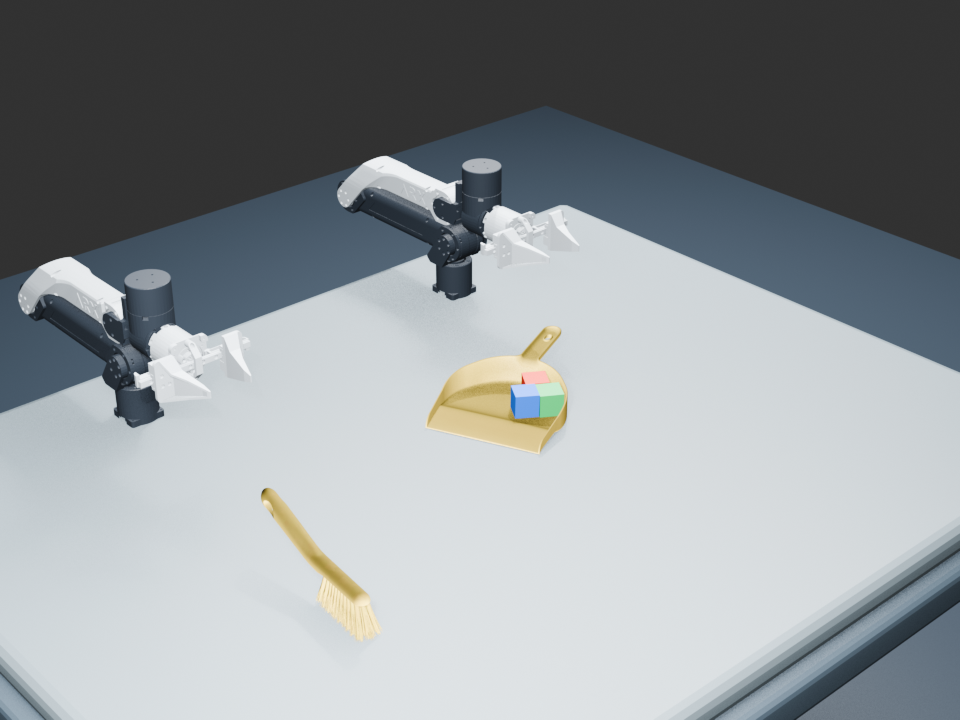

# RoboDojo Sweep Blocks — Blender MVP

Blender reproduction of the RoboDojo Sweep Blocks task with official visual
assets, numerical IK, scripted handoff, dynamic cubes, collision checking,
and bristles-down transfers. This is **not the Isaac Sim runtime or a trained
VLA policy**. See [THIRD_PARTY.md](THIRD_PARTY.md) for upstream attribution.

## Latest result

- [Video (4× speed)](output_smooth/sweep_blocks_smooth.mp4)
- [Editable Blender scene](output_smooth/sweep_blocks_smooth.blend)
- [Acceptance report](output_smooth/collision_report.json)
- Success at step 986/1000; zero detected robot collision events in 3,997
  sampled poses. Sampled checks are not a continuous-time collision proof.
- Transfers: measured maximum tilt 0.04°, angular speed 91.43°/s.



## Reproduce

Tested with Blender 5.2.1 on Apple Silicon. Install Blender and FFmpeg and make
`blender` and `ffmpeg` available on PATH. Blender supplies Python and NumPy.
Original predicate bodies are loaded from a separate upstream checkout:

```bash
git clone https://github.com/RoboDojo-Benchmark/RoboDojo.git ../RoboDojo
git -C ../RoboDojo checkout 08b7ee46034c3d0c8a389b2b7bfc138f4d55ee4d
# Alternatively: export ROBODOJO_ROOT=/path/to/RoboDojo
bash run_smooth.sh
```

`run_smooth.sh` starts from the included accepted collision-aware scene.
`bash run_collision.sh` rebuilds that scene from assets and validates it first.
Scripts stop if acceptance fails; a saved scene alone does not imply success.

## Project history

All implementation and diagnostic scripts are included. `output/`,
`output_official/`, `output_trial/`, and `output_verified/` preserve earlier
iterations, **including known failures**; use `output_smooth/` for the latest
accepted result. Frame-sequence caches, logs, bytecode, and automatic Blender
backups are intentionally excluded; the rendering scripts regenerate frames.

The sections below document earlier versions, not additional success claims.

**Smooth-transfer revision:** `bash run_smooth.sh` retains the accepted contact
strokes but replaces six free transfers with bristles-down Cartesian paths.
Outputs: `output_smooth/`. See [SMOOTH_VERSION.md](SMOOTH_VERSION.md).

**Collision-aware implementation:** use `bash run_collision.sh` and read
[COLLISION_VERSION.md](COLLISION_VERSION.md). Outputs are in `output_collision/`;
acceptance requires `collision_report.json` to contain `qualified: true`.
It uses official meshes, calibrated grasps, and collision-checked trajectories.
The previous `output_verified/` version passes task predicates but has known
arm interpenetration; it is retained for comparison, not recommended for use.
The older `run_official.sh` output has known grasp/collision/checker limitations
and must not be described as an original-task success.

The original MVP described below reproduces the control structure of RoboDojo's `sweep_blocks`
task in Blender on Apple Silicon. It intentionally uses lightweight procedural
geometry for the first milestone so the physics/control loop can be tested
without Isaac Sim, CUDA, or the full RoboDojo asset download.

What is preserved from the official task:

- 1,000-step episode limit.
- Two scripted ARX X5-style robot arms.
- Left-arm pickup followed by a right-arm handoff.
- Three blocks are dynamic rigid bodies; their locations are never keyframed.
- The broom is a kinematic collision body and must move the blocks physically.
- Success checks the blocks are in the dustpan, the dustpan remains on the
  table and upright, the dustpan is left of the parked broom, and both arms
  return home.

What is simplified:

- Procedural proxy meshes replace the official USD/URDF visual assets.
- Arm motion is kinematic and grasp/handoff are scripted.
- Blender rigid-body physics replaces Isaac Sim/PhysX.

## Run

```bash
cd /Users/quanyukai/robodojo-blender-mvp
./run.sh
```

For the official-asset/URDF version:

```bash
./run_official.sh
```

That version uses the official fixed `sweep_blocks_0` layout, X5 URDF/STL
meshes, official USDZ tool/object meshes, numerical joint IK, and the original
support-circle success threshold.

Outputs are written to `output/`:

- `sweep_blocks_mvp.blend` — editable Blender scene.
- `success_frame.png` — rendered validation frame.
- `handoff_frame.png` — frame 250 tool handoff preview.
- `sweep_frame.png` — frame 620 rigid-body sweep preview.
- `result.json` — per-condition result and final block coordinates.

Open the `.blend` file and press Play from frame 1 to inspect the full motion.

## Relevant official RoboDojo sources

- `/Users/quanyukai/RoboDojo/task/RoboDojo/tasks/sweep_blocks.py`
- `/Users/quanyukai/RoboDojo/task/RoboDojo/config/sweep_blocks.yml`
